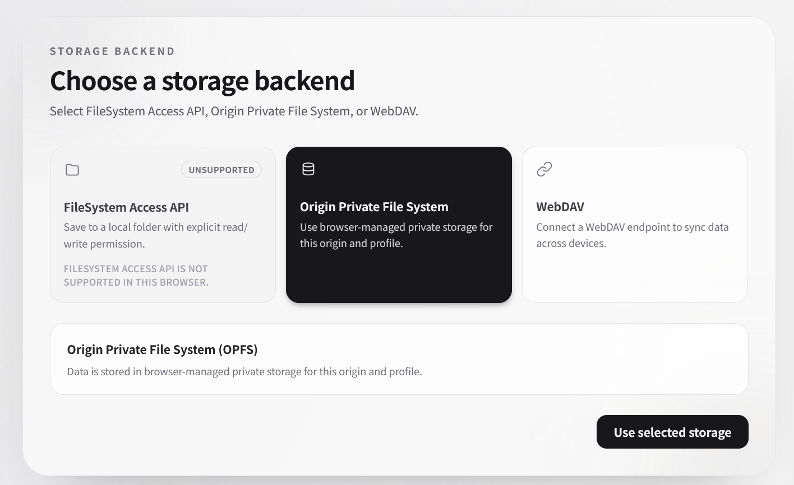
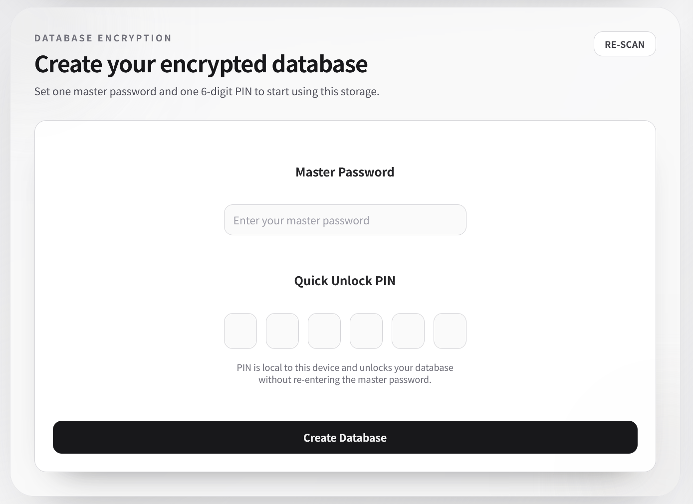
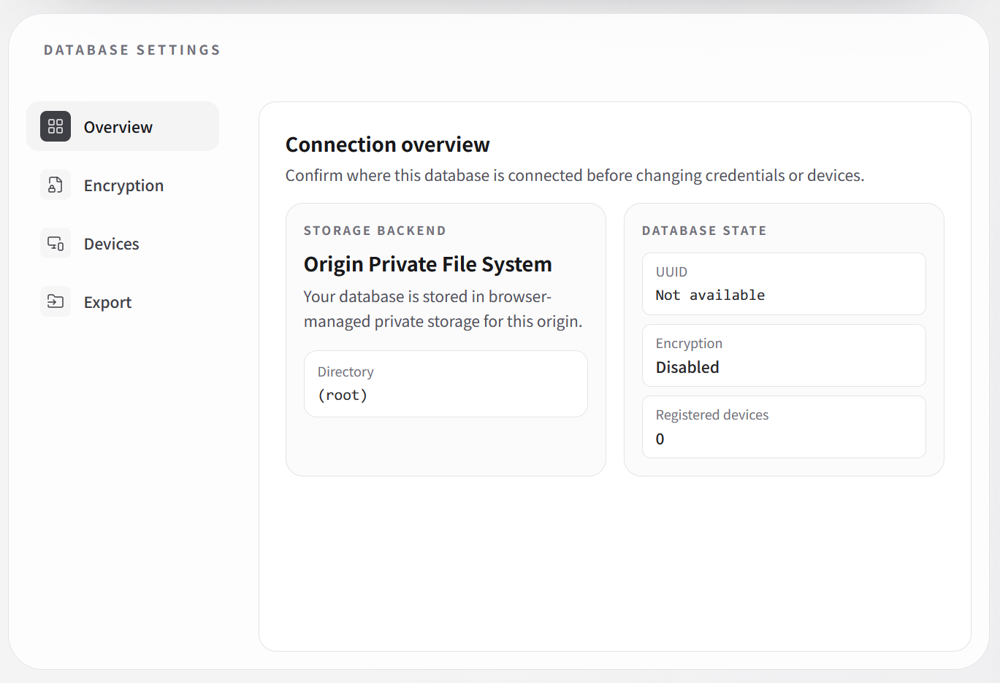

## `clxdb`


> [!WARNING]
> **DO NOT USE THIS IN PRODUCTION**  
> ClxDB is not battle-tested. Use at your own risk.

### Description

A serverless synchronization engine that uses WebDAV or the FileSystem Access API for storage.  
Sync documents and blobs via _your own cloud_. Designed for single-html applications.

### Features

- Bring-your-own-cloud sync
- Encryption support
- Optional UI components

### Example

```ts
import { startClxDBWithUI } from 'clxdb/ui';

// Assume these exist in your app.
const database = createDatabase();
const databaseAdapter = createDatabaseClxDBAdapter(database);

// This will automatically open a database, using the storage picker / unlock UI.
const client = await startClxDBWithUI({ database: databaseAdapter });

// Write blobs
const blobDigest = await client.blobs.putBlob(
  new Blob(['hello clxdb']),
  { name: 'hello.txt' }
);

// Update using your own database API. They will be synced automatically.
await database.updateDocument('doc-1', {
  title: 'Updated title',
  attachmentDigest: blobDigest,
});
```

### Database Interface

You should implement these methods to integrate your own backend with ClxDB.

```ts
import type { DatabaseDocument, ShardDocument } from 'clxdb';

export interface DatabaseBackend {
  // Initialize local storage for this clxdb instance uuid.
  initialize(uuid: string): Promise<void>;

  // Return documents in the same order as ids. Missing docs must be null.
  read(ids: string[]): Promise<(DatabaseDocument | null)[]>;

  // Return ids currently staged for sync (seq === null).
  readPendingIds(): Promise<string[]>;

  // Apply remote/synced upserts (seq is a concrete number).
  upsert(data: ShardDocument[]): Promise<void>;

  // Apply remote/synced deletions.
  delete(data: ShardDocument[]): Promise<void>;

  /**
   * Subscribe to local user-originated changes.
   * - User writes/deletes should be staged with seq: null.
   * - Only seq === null changes should trigger onUpdate.
   * - Return an unsubscribe function.
   */
  replicate(onUpdate: () => void): () => void;
}
```

Please note that the update by user must be handled using a two-step mechanism.  
If deleting hinders you, consider using a soft-delete instead.

> [!NOTE]
> There is one single rule:  
> The user-originated updates are always `seq: null`

* Insertion / Update
  1. Mark as `seq: null`
  2. After the ClxDB sync, the ClxDB calls `upsert()` and updates the seq.  
     This does not need to be replicated, but doing so won't cause any errors.
* Deletion
  1. Mark as `del: true`, `seq: null`
  2. After the ClxDB sync, it commits the real deletion.  
     This does not need to be replicated, but doing so won't cause any errors.

### Expected Workload

- **Documents:** 100 creations/hr, 10 updates/hr, 1 deletion/hr. Total ~20,000 docs, expected to grow up to 100MB.
- **Blobs:** 10 creations/hr, 0.1 deletions/hr. Total ~5,000 files, expected to grow up to 4GB.
- **Sync:** ~5 devices. Low concurrency is expected.

These are not hard limits, but exceeding them may lead to performance degradation.

### Storage Structure

```
/
├── manifest.json
├── shards/
│   ├── shard_{hash}.clx
│   └── ...
└── blobs/{hash:2}
    ├── {hash}.clb
    └── ...
```

### Screenshots

|  |  |  |
| --------------------------------------------------------- | ------------------------------------------------ | -------------------------------------------------- |
| Storage Selector                                          | Onboarding                                       | Settings                                           |
